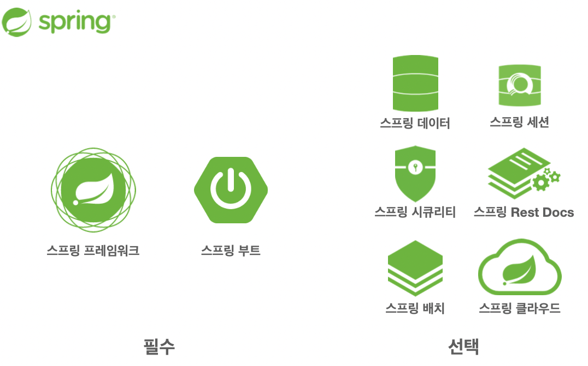
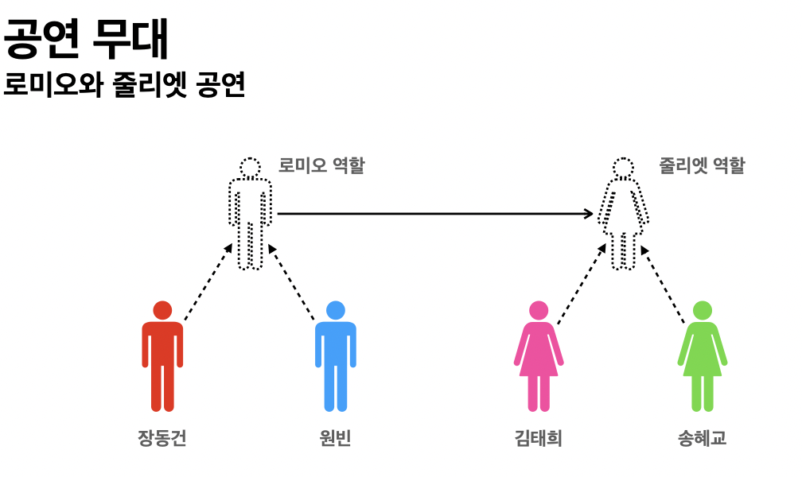
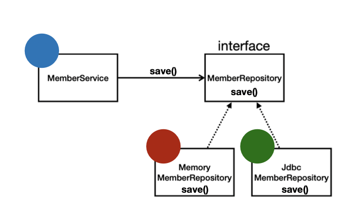

# 객체 지향 설계와 스프링

스프링의 핵심 가치 = 객체 지향 프로그래밍

# 1. 스프링이란?



스프링은 어떠한 하나가 아니다.

여러가지 모음!

## 1.1. 스프링 프레임워크

- 핵심기술
  - 스프링 DI 컨테이너
  - AOP
  - 이벤트
  - 기타
- 웹기술    
  - 스프링 MVC
  - 스프링 WebFlux
- 데이터 접근 기술
  - 트랜잭션
  - JDBC
  - ORM 지원
  - XML 지원
- 기술 통합
  - 캐시
  - 이메일
  - 원격접근
  - 스케줄링
- 테스트
  - 스프링 기반 테스트 지원
- 언어
  - 코틀린
  - 그루비
- 최근에는 스프링 부트를 통해서 스프링 프레임워크 기술들을 편리하게 사용

## 1.2. 스프링 부트

스프링을 편리하게 사용할 수 있도록 지원(최근에는 기본으로 사용)

- 장점
  - 단독으로 실행할 수 있는 스프링 애플리케이션을 쉽게 생성
  - Tomcat 같은 웹 서버를 내장해서 별도의 웹 서버를 설치하지 않아도 된다.
  - 손쉬운 빌드 구성을 위한 starter 종속성 제공
  - 스프링과 3rd parth(외부) 라이브러리 자동 구성
  - 메트릭, 상태확인, 외부 구성 같은 프로덕션 준비 기능 제공
  - 관례에 의한 간결한 설정

## 1.3. 스프링 단어✅

- 스프링이라는 단어는 문맥에 따라 다름
  - 스프링 DI 컨테이너 기술
  - 스프링 프레임워크
  - 스프링 부트, 스프링 프레임워크 등을 모두 포함한 생태계를 스프링이라고 함

## 1.4. 스프링 핵심 개념✅

- 스프링은 자바 언어 기반의 프레임워크
- 자바 언어의 가장 큰 특징 = `객체 지향 언어`
- 스프링은 객체 지향 언어가 가진 가장 강력한 특징을 살려내는 프레임워크
- 스프링은 `좋은 객체 지향` 애플리케이션을 개발할 수 있게 도와주는 프레임워크


# 2. 객체 지향 프로그래밍

- 객체 지향 프로그래밍은 컴퓨터 프로그램을 명령어의 목록으로 보는 시각에서 벗어나 여러 개의 독립된 단위 `객체들의 모임`으로 파악
- 각각의 객체는 메세지를 주고받고, 데이터 처리(협력)
- 객체 지향 프로그래밍은 `프로그램을 유연하고 변경이 용이`하게 만들기 때문에 대규모 소프트웨어 개발에 많이 사용
  - 유연하고 변경이 용이?
    - 키보드 키캡 바꿔 끼듯
    - 컴퓨터 부품 조립하듯
    - 컴포넌트를 쉽고 유연하게 변경하면서 개발하는 방법

## 2.1. 좋은 객체 지향 프로그래밍

- 객체 지향 특징
  - 추상화
  - 캡슐화
  - 상속
  - 다형성(Polymorphism)⭐

### 2.1.1. 다형성 실세계 비유

- 우리가 사는 세상을 역할과 구현으로 세상을 구현한다고 생각 했을 때 

1. 운전자 - 자동차

  

자동차의 역할을 만들고 구현을 분리한다고 생각하면 운전자(Client)를 위해서

- 구현체가 바껴도 운전자에 영항을 안줌 
- 부품이 바껴도 Client에 영향을 끼치지 않는다
- Client의 영향을 주지않고 새로운 기능 제공가능
  - 새로운 자동차가 나와도 클라이언트는 새로운걸 배우지 않아도됨.

2. 공연 무대

  

역할마다 다른 배우는 어떤 상황이 날지 모르니깐 대체가 가능해야됨(유연함)

- 변경이 가능한 대체 가능성이 생기게 되는데 이것은 `유연하고 변경이 용이`하다.

## 2.2. 역할과 구현을 분리

`역할`과 `구현`으로 구분하면 세상이 단순해지고, 유연해지며 변경도 편리해진다.

- 장점
  - 클라이언트는 대상의 역할(인터페이스)만 알면 된다.
  - 클라이언트는 구현 대상의 내부 구조를 몰라도 된다.
  - 클라이언트는 구현 대상의 내부 구조가 변경되어도 영향을 받지 않는다.
  - 클라이언트는 구현 대상 자체를 변경해도 영향을 받지 않는다.

- 자바 언어에서 활용한다면
  - 역할 = 인터페이스
  - 구현 = 인터페이스를 구현한 클래스, 구현 객체
  - 객체를 설계할 때 역할과 구현을 명확히 분리한다.
  - 객체 설계시 역할(인터페이스)을 먼저 부여하고, 그 역할을 수행하는 구현 객체 만들기
    - 핵심은 인터페이스가 먼저, 구현보다는 역할을 먼저 정하자

```
객체의 협력이라는 관계부터 생각하자
- 혼자있는 객체는 없다.
- 클라이언트(요청)/서버(응답)
- 수많은 객체 클라이언트와 객체 서버는 서로 협력 관계를 가진다.
```

## 2.3. 자바 언어의 다형성



- 오버라이딩 된 메서드 실행
- 다형성으로 인터페이스를 구현한 객체를 실행 시점에 유연하게 변경
- 클래스 상속 관계도 다형성과 오버라이딩 적용 가능

```
🥕오버로딩: 메소드를 여러개 정의
🥕오버라이딩: 기능을 재정의
```

### 2.3.1. 다형성의 본질

- 인터페이스를 구현한 객체 인스턴스를 `실행 시점에서 유연하게 변경`할 수 있다.
- 다형성의 본질을 이해하려면 `협력`이라는 객체사이의 관계에서 시작해야한다.
- ⭐클라이언트를 변경하지 않고, 서버의 구현 기능을 유연하게 변경할 수 있다.

## 2.4. 역할과 구현을 분리 (정리, 한계)

- 정리
  - 실세계의 역할과 구현이라는 편리한 컨셉을 다형성을 통해 객체 세상으로 가져올 수 있음
  - 유연하고, 변경이 용이
  - 확장 가능한 설계
  - 클라이언트에 영향을 주지 않는 변경 가능
  - 인터페이스를 안정적으로 잘 설계하는 것이 중요

- 한계
  - 역할(인터페이스) 자체가 변하면, 클라이언트, 서버 모두에 큰 변경이 발생한다.
  - 만약 자동차를 비행기로 변경해야 한다면?
  - 만약 대본 자체가 변경된다면?
  - 만약 USB 인터페이스가 변경된다면?

- 따라서 인터페이스를 안정적으로 잘 설계하는 것이 중요

API를 설계할 때 API 자체를 안정적으로 잘 설계해야함
- 변화가 있어도 인터페이스 자체가 흔들리지 않게 설계하기\

## 2.5. 스프링과 객체지향

다형성이 가장 중요!

- 스프링은 다형성을 극대화해서 이용할 수 있게 도와준다.
- 스프링에서 이야기하는 제어의 역전(IoC), 의존관계 주입(DI)은 다형성을 활용해서 역할과 구현을 편리하게 다룰 수 있도록 지원
- 스프링을 사용하면 마치 건담 조립하듯, 공연무대 배우를 섭외하듯 구현을 편리하게 변경할 수 있다.

# 3. 좋은 객체 지향 설계의 5가지 원칙(SOLID)


# 4. 객체 지향 설계와 스프링


[다음강의로](/강의정리/2_스프링핵심원리이해1_예제만들기.md)